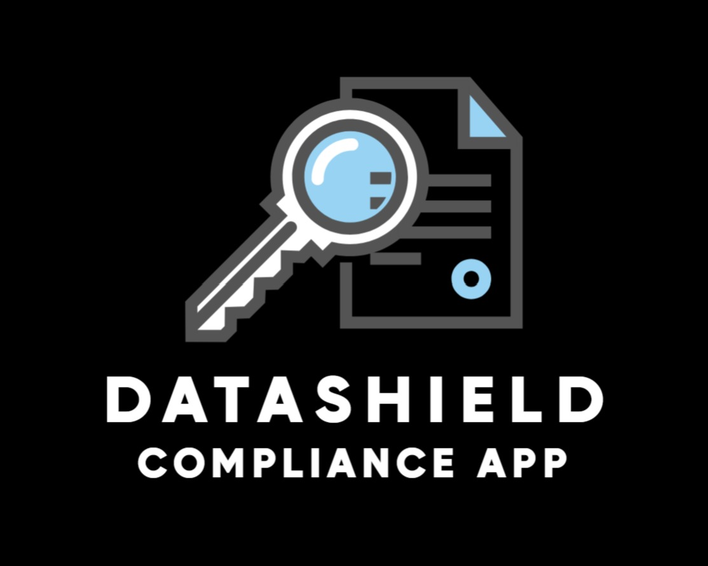
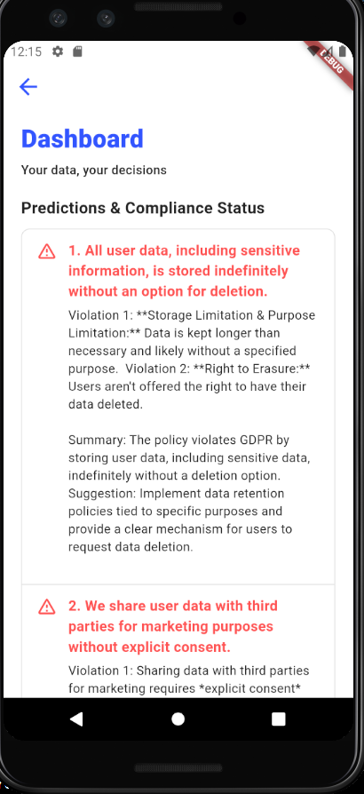
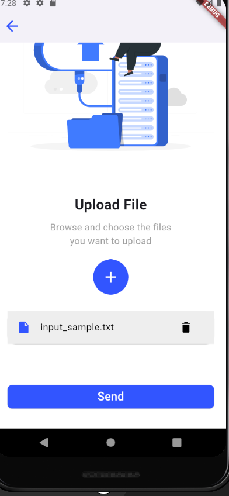

# navigating_digital_rights
# DataShield : Compliance App


**DataShield** is an open-source mobile application designed for businesses and individuals who need to ensure regulatory compliance. This unified solution combines:

1. **GDPR Compliance Checker:**  
   - Analyzes text input to determine whether it violates GDPR.
   - Uses a machine learning pipeline (with TF-IDF, SMOTE, and multiple classifiers) to classify text as **"Compliant"** or **"Non-compliant"**.

This feature is integrated into a mobile app built with Flutter. The backend API is built using **FastAPI** and secured via API keys.

---

## Problem Statement

### **Problem:**  
In today's fast-paced environment, organizations and individuals face challenges in maintaining GDPR compliance. Manual checks for compliance can result in severe penalties and inefficiencies.

### **Solution:**  
DataShield addresses these issues by providing:
- An **automated GDPR compliance checker** that quickly verifies if a text statement violates data protection regulations.

---

## Features

### **GDPR Compliance Checker:**
- Uses a custom text preprocessing function to clean input text.
- Transforms text into TF-IDF features.
- Applies SMOTE to balance class distribution.
- Evaluates multiple classifiers (Random Forest, XGBoost, Logistic Regression, Naive Bayes, Decision Tree, SVM).
- Logs detailed diagnostics, including token frequencies, evaluation metrics, expected vs. actual outputs, and vocabulary of the best model.
- Provides a `/predict` endpoint that returns a prediction.

### **Unified Mobile App:**
- Developed in Flutter for cross-platform compatibility.
- Connects to FastAPI endpoints (secured with API keys) for GDPR compliance checking.

---

## Technology Stack

- **Mobile App Frontend:** Flutter
- **Backend API:** FastAPI
- **Machine Learning:** scikit-learn, imbalanced-learn, XGBoost
- **Database:** Supabase
- **Visualization:** Matplotlib

---

## Setup Instructions

### **Prerequisites**

- Python 3.11.0
- Flutter SDK
- Required Python packages:
  ```bash
  pip install fastapi uvicorn flask pandas scikit-learn imbalanced-learn xgboost matplotlib
  ```

### **Backend Setup (FastAPI)**

#### **Clone the Repository:**
```bash
git clone https://github.com/yourusername/datasheild.git
cd datasheild
```

#### **Run the FastAPI Server:**
```bash
uvicorn main:app --reload
```

### **Mobile App Setup (Flutter)**

#### **Clone the Flutter App Repository:**
```bash
git clone https://github.com/yourusername/datasheild-app.git
cd datasheild-app
flutter pub get
```

#### **Run the Flutter App:**
```bash
flutter run
```

### **How to Use**

#### **GDPR Compliance Check:**
Send a POST request to the `/predict` endpoint with JSON payload:
```json
{
  "text": "Your text to check for GDPR compliance."
}
```
Response example:
```json
{
  "prediction": "Compliant"
}
```

### **File Structure**
```
.
├── app-backend
│   ├── app.py          # FastAPI backend
│   ├── models.py       # ML model logic
│   ├── requirements.txt # Dependencies
│   ├── feature_space.png
│   ├── README.md
│   ├── main.py         # API entry point
│   ├── datasets        # GDPR data files
│   └── tests           # Unit tests
│
├── app-frontend
│   ├── images
│   │   ├── pic1.png
│   │   ├── pic2.png
│   ├── lib
│   ├── assets
│   ├── pubspec.yaml
│   └── main.dart       # Flutter entry point
```

---

# GDPR Compliance Prediction API

## 📌 Overview
The **GDPR Compliance Prediction API** is a machine learning-powered API that predicts whether a given text violates **GDPR regulations**. The API uses **XGBoost**, **TF-IDF**, and **SMOTE** to classify text as **"compliance"** or **"violated"** based on GDPR requirements.

## 🚀 MVP (Minimum Viable Product)
### ✅ **Core Features**

#### **1️⃣ GDPR Compliance Prediction**
- Accepts **text file uploads (`.txt`)**.
- Uses **Machine Learning (XGBoost, TF-IDF, SMOTE)** to classify text.
- Returns a **clear response**: `"compliance"` or `"violated"`.

#### **2️⃣ Machine Learning Pipeline**
- **Text Preprocessing**: Converts text to **lowercase**, removes **non-alphabetic characters**.
- **TF-IDF Vectorization**: Converts text into numerical representation.
- **SMOTE Oversampling**: Handles **imbalanced data**.
- **XGBoost Classifier**: Predicts GDPR compliance.

#### **3️⃣ API Endpoints**
- `GET /` → Returns a welcome message (API status check).
- `POST /predict` → Accepts a `.txt` file and predicts GDPR compliance.

#### **4️⃣ Model Evaluation & Performance Metrics**
- Calculates **accuracy** and **ROC-AUC score** to measure model effectiveness.

### **Screenshots**

  
  

---

## **Future Plans**

### **Reminder-Based Email System for Tax Deadlines**
- **Purpose:** Send reminder emails before tax deadlines such as **TDS, TCS, ITR, Advance Tax**, etc.
- **Reminder Timeline:** Emails will be sent **10 days, 5 days, and 1 day** before each deadline.
- **Data Source:** Since there is no public API available, we will **scrape tax-related websites** (e.g., **ClearTax**) to extract deadline information.
- **Storage:** Data will be stored in **Supabase**.
- **Email Service:** Use an **open-source mail service** to send automated reminders.


---

## **Author**
Developed by **VijayRS124**
